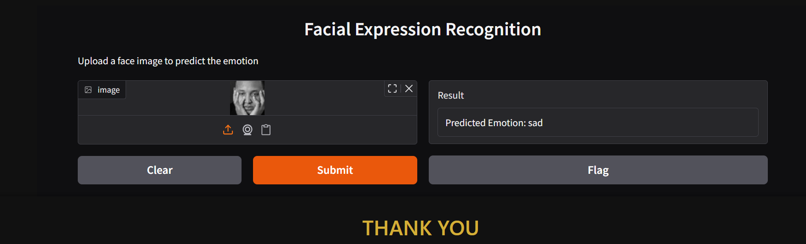

# Facial Expression Recognition 🎭

This project focuses on identifying human emotions from facial expressions using Deep Learning techniques. The model can recognize various emotions such as **Happy, Sad, Angry, Surprise, Neutral, etc.**

## 📸 Demo
 
*(See the instruction below to replace this with your image)*

## 🚀 Features
* **Real-time Detection:** Ability to process live video feed from a webcam.
* **Deep Learning Model:** Built using CNN (Convolutional Neural Networks).
* **High Accuracy:** Optimized for various lighting conditions and angles.

## 🛠️ Tech Stack
* **Language:** Python
* **Libraries:** TensorFlow / Keras, OpenCV, Pandas, NumPy
* **Tools:** Jupyter Notebook, Scikit-learn

## 📊 Dataset
The model was trained on the **FER2013** dataset (or mention your specific dataset), which contains thousands of labeled facial images.
https://www.kaggle.com/c/challenges-in-representation-learning-facial-expression-recognition-challenge/data

## ⚙️ How to Run
1. Clone the repository:
   ```bash
   git clone [https://github.com/mohamedyousef-dev/Facial-Expression-Recognition.git](https://github.com/mohamedyousef-dev/Facial-Expression-Recognition.git)
